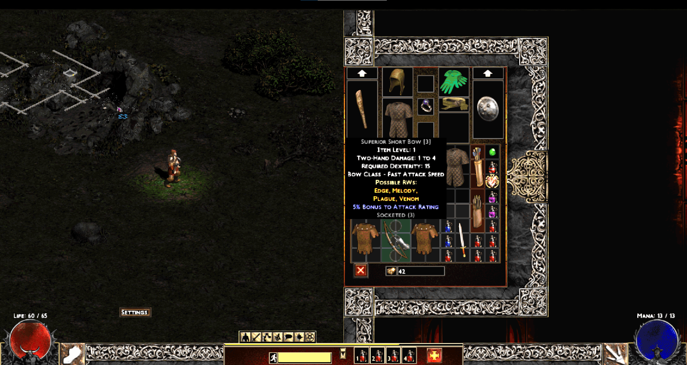
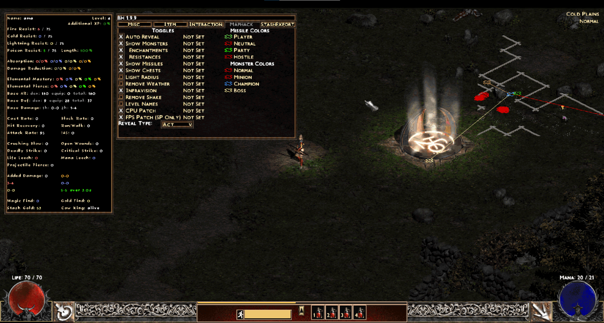

# diablo2-fod-add

original module :https://www.moddb.com/mods/the-forces-of-darkness

* 1920x1080 (upscale by ddraw) 

## Mod Information
* [Readme](readme.txt)
* [charm affixes](charmaffixes.txt)
* [crafting recipes](craftingrecipes.txt)

## Changelog

* Update BH.dll ( restore original BH.dll and modules for MapHack. https://github.com/youbetterdont/slashdiablo-maphack) . fod's bh.dll rename bh.dll_fod. You can revert at any time.

* Update ddraw (Replace ddraw to improve DirectDraw speed and upscale drawing https://github.com/CnCNet/cnc-ddraw )

## Inastall

* If you do not use d2se, you can use PatchD2File.exe to load PlugY. PatchD2File.exe will inject PlugY into Game.exe.
* regedit.exe , change  "Render"=dword:00000000 in  [HKEY_CURRENT_USER\SOFTWARE\Blizzard Entertainment\Diablo II\VideoConfig] 
